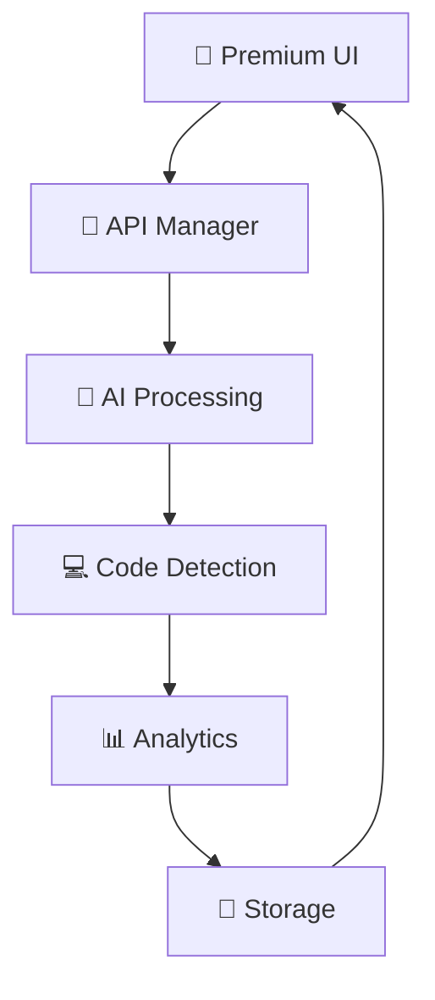

# 🦇 ELYOUSSEFI EVIL - ULTIMATE EDITION PREMIUM

<div align="center">


**⚡ Advanced AI Chat Interface with Unlimited Tokens & Premium Features ⚡**

</div>

---

## 🎯 Overview

> **ELYOUSSEFI EVIL PREMIUM** is a sophisticated AI chat application featuring unlimited tokens, advanced code detection, real-time analytics, and a premium dark-themed interface with smooth animations.

<div align="center">


</div>

## ✨ Premium Features

### 🚀 Core Capabilities
- **🔓 Unlimited Token Usage** - No restrictions on API calls
- **⚡ Maximum Response Speed** - Optimized streaming performance
- **💎 Premium AI Models** - Multiple model support via OpenRouter
- **🎨 Premium UI/UX** - Advanced animations and smooth scrolling

### 🎭 Visual Excellence
- **🌈 Custom Theme System** - 5+ premium themes with real-time switching
- **🔲 Curved Corners** - Modern UI with smooth rounded elements
- **✨ Smooth Animations** - Pulse effects and transition animations
- **🎯 ChatGPT-Style Code Frames** - Professional code display interface

### 🔧 Advanced Tools
- **💻 Smart Code Detection** - Automatic language identification for 10+ programming languages
- **📊 Real-time Analytics** - Comprehensive usage statistics and performance metrics
- **🧠 AI Memory System** - Persistent conversation context and system prompts
- **🔌 Plugin Architecture** - Extensible plugin system with pre-built utilities

### 🛡️ Premium Security
- **🔐 Encrypted Storage** - Secure API key and conversation storage
- **🔄 Auto-save System** - Automatic backup and session recovery
- **⚡ Failover Protection** - Robust error handling and fallback systems

## 🏗️ Architecture

### 📦 Core Components

```
🦇 ELYOUSSEFI EVIL PREMIUM/
├── 🎨 Theme Manager
│   ├── Dark Red Theme
│   ├── Cyber Blue Theme
│   ├── Matrix Green Theme
│   ├── Neon Purple Theme
│   └── Fire Orange Theme
├── ⚡ Animation Engine
│   ├── Pulse Effects
│   ├── Smooth Scrolling
│   └── Fade Transitions
├── 💻 Code Detection
│   ├── 10+ Language Support
│   ├── Syntax Highlighting
│   └── ChatGPT-Style Frames
├── 📊 Analytics Dashboard
│   ├── Usage Statistics
│   ├── Performance Metrics
│   └── Real-time Monitoring
└── 🔌 Plugin System
    ├── Grammar Checker
    ├── Code Formatter
    └── Sentiment Analyzer
```

### 🔄 System Flow



## 🚀 Installation & Setup

### 📋 Prerequisites

```bash
# Required Packages
🐍 Python 3.8+
📦 requests library
🎨 tkinter (usually included)
```

### ⚡ Quick Start

1. **Clone the Repository**
   ```bash
   git clone https://github.com/elyam/evil-premium.git
   cd evil-premium
   ```

2. **Run the Application**
   ```bash
   python v15.py
   ```

3. **🔑 API Configuration**
   - Enter your OpenRouter API key when prompted
   - Select preferred AI model
   - Customize theme and settings

## 🎮 Usage Guide

### 💬 Basic Chatting
1. **Enter your message** in the premium input field
2. **Press Enter** or click **🚀 SEND** for instant response
3. **Watch real-time streaming** with smooth animations

### 💻 Code Features
- **Automatic Detection** - Code blocks are automatically detected and formatted
- **Syntax Highlighting** - Professional code display with language-specific colors
- **One-Click Copy** - Copy code to clipboard with single click
- **File Export** - Save code blocks directly to files

### 🎨 Theme Customization
1. Click **🎨 THEMES** button in header
2. Choose from 5+ premium themes
3. Customize individual colors
4. Toggle curved corners

### 📊 Analytics Access
1. Click **📊 ANALYTICS** in header
2. View real-time usage statistics
3. Monitor performance metrics
4. Export analytics data

## 🔧 Advanced Features

### 🧠 AI Memory System
```python
# Custom system prompts
"You are EVIL PREMIUM - an advanced AI assistant with unlimited capabilities."
```

### 🔌 Plugin Development
```python
class CustomPlugin(Plugin):
    def __init__(self, app):
        super().__init__(app)
        self.name = "Custom Plugin"
    
    def on_message_received(self, message):
        # Custom processing logic
        pass
```

### 💾 Data Management
- **Auto-save** - Conversations automatically saved
- **Export Options** - JSON, PDF, HTML formats
- **Session Management** - Multiple chat sessions support

## 🎯 Supported AI Models

### 🤖 Available via OpenRouter
- **DeepSeek Chat** - `deepseek/deepseek-chat`
- **DeepSeek Coder** - `deepseek/deepseek-coder`
- **GPT-3.5 Turbo** - `openai/gpt-3.5-turbo`
- **Claude Instant** - `anthropic/claude-3-haiku`
- **Llama 3.1 8B** - `meta-llama/llama-3.1-8b-instruct`

## 💻 Code Detection Support

### 🛠️ Languages Identified
- **🐍 Python** - Functions, classes, imports
- **🌐 JavaScript** - Functions, ES6 syntax, DOM operations
- **☕ Java** - Classes, methods, System.out
- **⚡ C++** - Includes, namespaces, streams
- **📄 HTML** - Tags, attributes, structure
- **🎨 CSS** - Selectors, properties, media queries
- **🐘 PHP** - PHP tags, functions, variables
- **🗃️ SQL** - Queries, DML, DDL statements
- **🐚 Bash** - Shebangs, commands, scripting
- **💎 Ruby** - Methods, classes, blocks

## 📊 Performance Metrics

### ⚡ Real-time Analytics
- **Message Count** - Total messages processed
- **Token Usage** - Comprehensive token tracking
- **Code Blocks** - Generated code statistics
- **API Performance** - Response times and success rates
- **Session Duration** - Active usage tracking

## 🎨 Theme Gallery

### 🎭 Available Themes
1. **🖤 Dark Red** - Classic evil aesthetic
2. **💙 Cyber Blue** - Futuristic blue theme
3. **💚 Matrix Green** - Terminal-inspired green
4. **💜 Neon Purple** - Vibrant purple scheme
5. **🧡 Fire Orange** - Warm orange tones

## 🔄 Keyboard Shortcuts

### ⌨️ Premium Shortcuts
- `Ctrl + N` - 🆕 New Chat
- `Ctrl + S` - 💾 Save Chat
- `Ctrl + O` - 📂 Load Chat
- `Ctrl + F` - 🔍 Search
- `Ctrl + C` - 💻 Toggle Code Frame
- `Ctrl + A` - 📊 Premium Analytics
- `Ctrl + T` - 🎨 Theme Customizer
- `Ctrl + Enter` - 🚀 Send Message

## 🛠️ Technical Details

### 📁 File Structure
```
evil-premium/
├── 🐍 v15.py                 # Main application
├── 🔑 Free Api.txt           # API configuration
├── 💾 autosave.evil          # Auto-save data
├── 🎨 themes/                # Theme configurations
├── 📊 analytics/             # Analytics data
└── 🔌 plugins/               # Plugin directory
```

### 🔧 Dependencies
```python
# Core Dependencies
import tkinter as tk          # GUI framework
import requests              # HTTP requests
import json                  # Data serialization
import threading             # Concurrent processing

# Premium Features
from datetime import datetime # Time tracking
import logging               # Advanced logging
import re                    # Pattern matching
```

## 🌟 Premium Benefits

### 💎 Compared to Standard Versions
| Feature | Standard | **PREMIUM** |
|---------|----------|-------------|
| Token Limits | ❌ Limited | **🔓 UNLIMITED** |
| UI Themes | 🎨 Basic | **🌈 Advanced** |
| Code Detection | 💻 Basic | **🤖 Smart** |
| Analytics | 📊 Minimal | **📈 Comprehensive** |
| Animations | ⚡ None | **✨ Smooth** |
| Plugins | 🔌 Limited | **🔧 Extensible** |

## 🐛 Troubleshooting

### 🔍 Common Issues
1. **API Key Errors**
   - Verify OpenRouter API key
   - Check internet connection
   - Ensure sufficient credits

2. **Theme Issues**
   - Restart application
   - Reset to default theme
   - Check system compatibility

3. **Performance Issues**
   - Close other applications
   - Check system resources
   - Update dependencies

### 📞 Support
For issues and feature requests, contact:
- **📧 Email**: [elyam.org@proton.me]
- **📱 Instagram**: [@laqvo](https://instagram.com/laqvo)

## 📈 Future Roadmap

### 🚀 Upcoming Features
- [ ] **🔊 Voice Integration** - Speech-to-text and text-to-speech
- [ ] **🌐 Web Search** - Integrated internet search capabilities
- [ ] **📱 Mobile App** - Cross-platform mobile version
- [ ] **🔐 Enhanced Security** - Advanced encryption and security features
- [ ] **🤖 More AI Models** - Expanded model support

## 👨‍💻 Developer

<div align="center">

### **ELYAM** 
#### *Senior Developer & AI Enthusiast*

[](https://instagram.com/laqvo)
[](https://github.com/elyam)

**"Crafting premium AI experiences with unlimited possibilities"**

</div>

## ©️ Copyright & Licensing

<div align="center">

---

### **© 2024 ELYOUSSEFI EVIL PREMIUM**
#### *All Rights Reserved*

**Developed with ❤️ by ELYAM**  
**Instagram: [@laqvo](https://instagram.com/laqvo)**

*This is a premium software product. Unauthorized distribution, modification, or commercial use is strictly prohibited.*

---


</div>

---

<div align="center">

**⭐ Star this repository if you find it awesome!**

*Last Updated: December 2024*  
*Version: Ultimate Edition v15.0*

</div>
